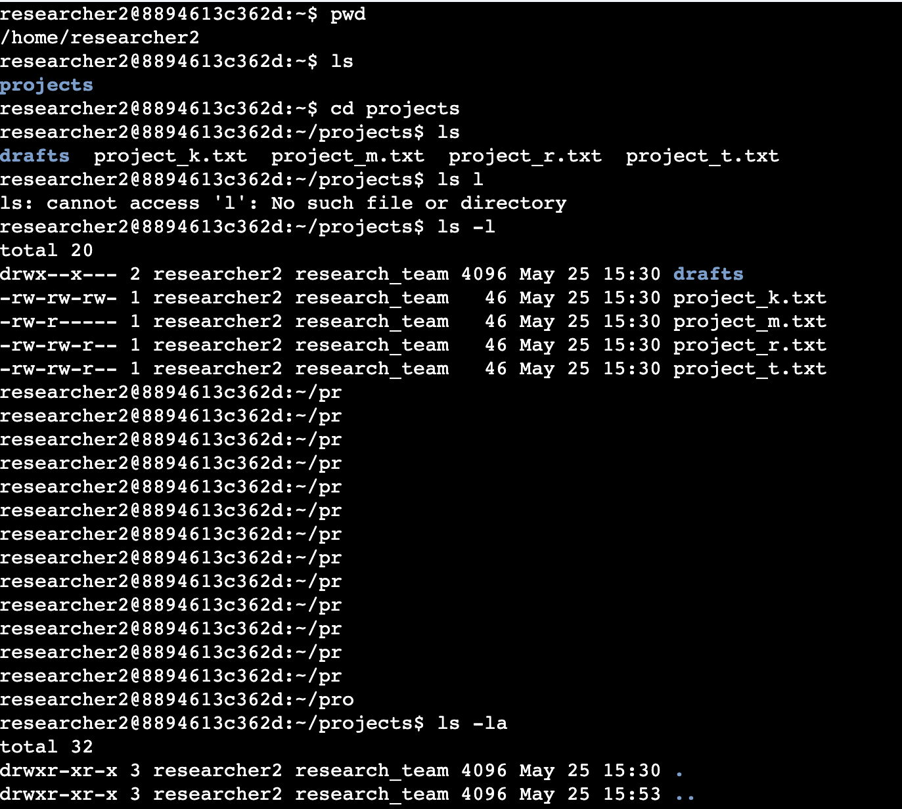
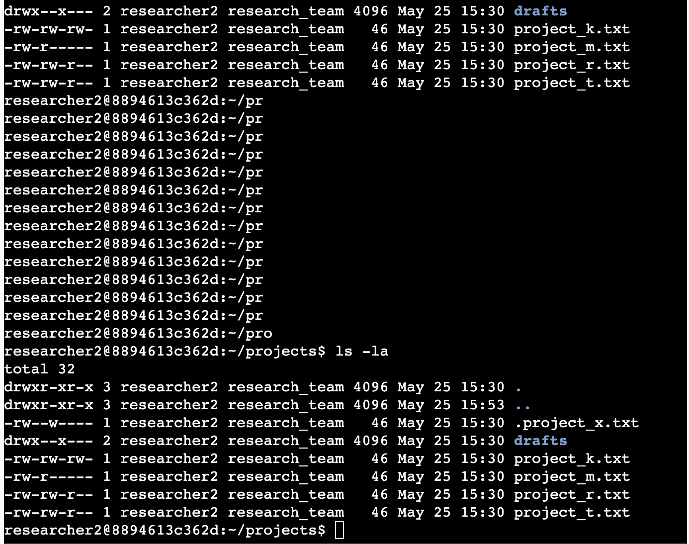
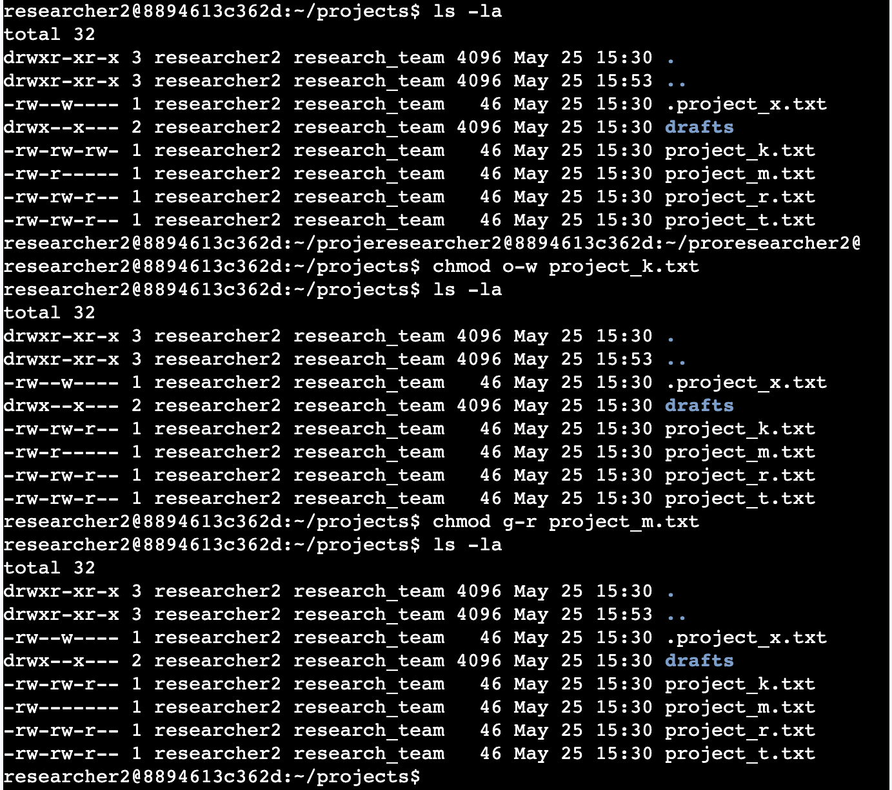
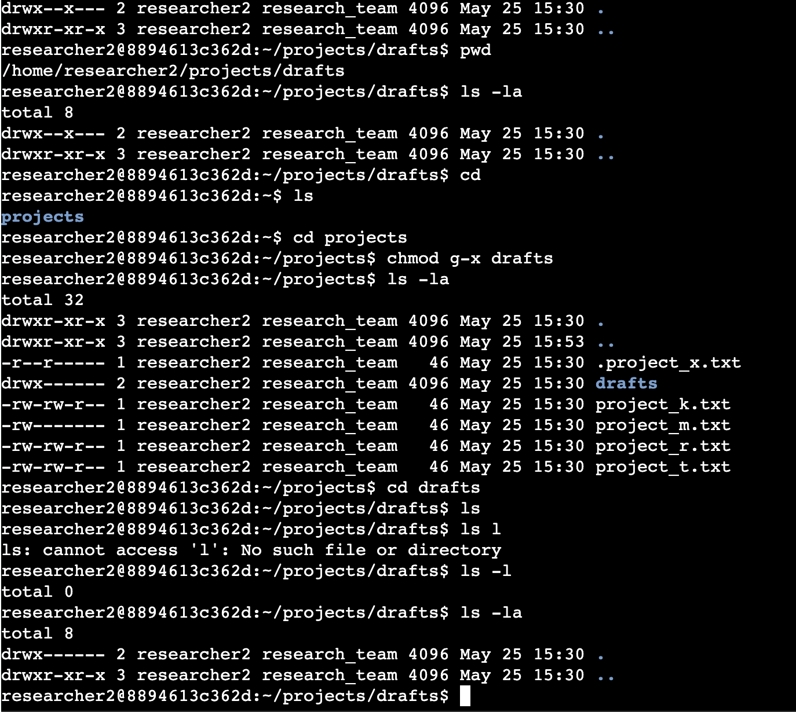

# File Permission in Linux 
This portfolio shows how to check and manage file permissions in Linux.   

## Project Description 
In this activity, I worked as a security professional responsible for managing file permissions for a research team. Using Linux commands, I checked existing permissions, identified unauthorized access, and modified permissions to improve security. I used commands such as `ls -la` to examine permissions and `chmod` to update authorization settings for files, hidden files, and directories. 

The directory used in these scenarios is/home/researcher2/projects/drafts, in which both the projects and the drafts have both subdirectories. 

## Check File and Directory Details 
The 'ls -la' command was used to check the hidden files and their permission settings. 

    

## Describe the Permissions String 
Here in the projects directory, it shows different permissions on different files and drafts. It has 10 character strings which shows permission in different ownerships (user, group, others) 
- The 1st character indicates the file type. The `d` indicates it is a directory. When this character is a hyphen (`-`), it represents a regular file.
- The 2nd–4th characters indicate the read (`r`), write (`w`), and execute (`x`) permissions for the user. When one of these characters is a hyphen (`-`), it means that permission is not granted to the user.
- The 5th–7th characters indicate the read (`r`), write (`w`), and execute (`x`) permissions for the group. When one of these characters is a hyphen (`-`), it means that permission is not granted to the group.
- The 8th–10th characters indicate the read (`r`), write (`w`), and execute (`x`) permissions for others. This category includes all other users on the system apart from the owner and group. When one of these characters is a hyphen (`-`), it means that permission is not granted to others.
  
    
## Change File Permissions 
In this part, I must determine whether any files have incorrect permissions and then change the permissions as needed. This action will remove unauthorized access and strengthen security on the system.

- None of the files should allow the other users to write to files.
- I check whether any files in the projects directory have write permissions for the owner type of other.
- I now then change the permissions of the file identified in the previous step so that the owner type of other doesn’t have write permissions using the (`chmod o-w project_k.txt`)
- In the scenario, the file project_m.txt is a restricted file and should not be readable or writable by the group or other; only the user should have these permissions on this file.
- I then used the (`chmod`) command to change permissions of the project_m.txt file so that the group doesn’t have read or write permissions.

  

## Change File Permissions on a hidden file 
In this part, I must determine if a hidden file has incorrect permissions and then change the permissions as needed. This action will further remove unauthorized access and strengthen security on the system.

- The file .project_x.txt is a hidden file that has been archived and should not be written to by anyone. (The user and group should still be able to read this file.)
- I need to check the permissions of the hidden file .project_x.txt
- Needs to change the permissions of the file .project_x.txt so that both the user and the group can read, but not write to, the file. (when naming a hidden file, start it with ".")

 

## Change Directory Permissions 
I must change the permissions of a directory. First, I'll check the group permissions of the /home/researcher2/projects/drafts directory and then modify the permissions as required. 

- Only the researcher2 user should be allowed to access the drafts directory and its contents.

 

## Summary 
Overall, I learned how to access and change permissions on Linux using different commands (`chmod`), (`ls -la`), which is a vital process especially as a security analyst, because they help manage and protect access to files and directories in Linux systems. The `ls -la` command allows analysts to view file permissions, ownership, and hidden files, which helps identify unauthorized access or insecure settings. The `chmod` command is used to modify permissions and remove unnecessary access from users, groups, or others. These commands are essential for enforcing the principle of least privilege, protecting sensitive data, and maintaining secure systems.
